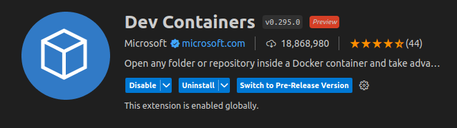
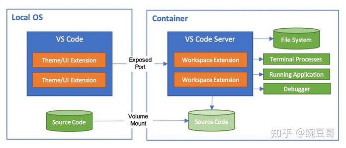
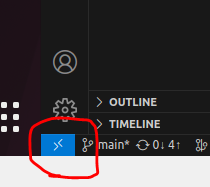
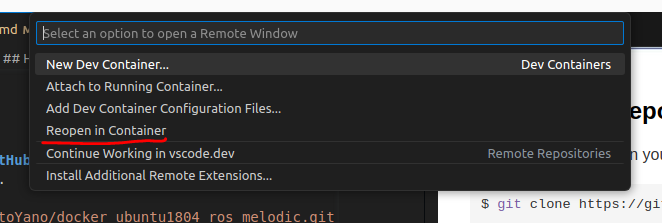
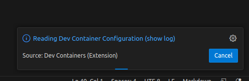
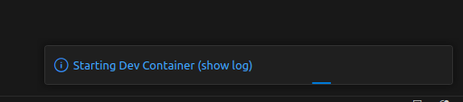
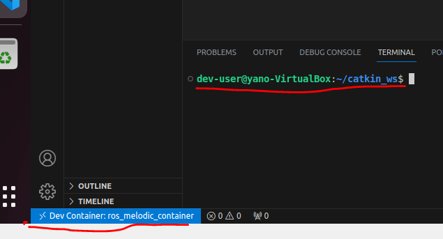
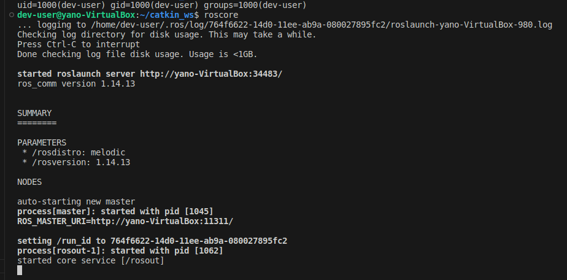
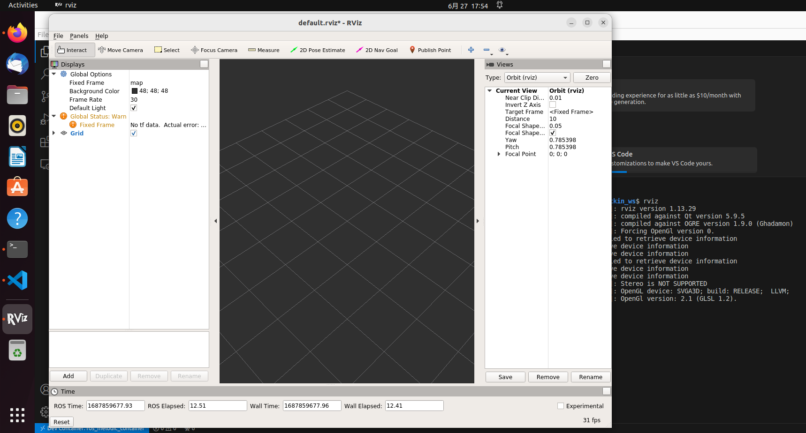

# docker_ubuntu1804_ros_melodic
Dockerfile to setup a docker container of Ubuntu 18.04 which includes ROS and GUI app like rviz can be displayed.  

## What is this?
By using a Dockerfile in this repository, you can build and run a docker image/container of Ubuntu 18.04 which has ROS Melodic and GUI application like rviz can be displayed. It will make your ROS environment setting up more efficient.  

## Supported platforms
* [main branch](https://github.com/ShisatoYano/docker_ubuntu1804_ros_melodic/tree/main): For native Linux or VM like VirtualBox  
* [for_wsl branch](https://github.com/ShisatoYano/docker_ubuntu1804_ros_melodic/tree/for_wsl): For WSL on Windows11

## Requirements
### OS
To install Docker Engine, you need the 64-bit version of one of these Ubuntu versions:  
* Ubuntu Lunar 23.04
* Ubuntu Kinetic 22.10
* Ubuntu Jammy 22.04 (LTS)
* Ubuntu Focal 20.04 (LTS)

### Applications
The following applications need to be installed in advance.  
* [Visual Studio Code](https://code.visualstudio.com/)
* [Docker](https://www.docker.com/)

## How to use
### 1. Install VSCode's extention for Docker
This extension is used to build a docker image, run a docker container and operate something in the container. Please find "Dev Containers" extension and install on your VSCode.  
  


### 2. Clone this repository from GitHub
#### 2-1. For native Linux or VM like VirtualBox
Clone this repository.  
```bash
$ git clone https://github.com/ShisatoYano/docker_ubuntu1804_ros_melodic.git
```

#### 2-2. For WSL on Windows11
Clone this repository with ```-b for_wsl``` option.  
```bash
$ git clone -b for_wsl https://github.com/ShisatoYano/docker_ubuntu1804_ros_melodic.git
```

### 3. Open this repo's directory by Dev Containers
After you intalled Dev Containers extension, you can see the following blue icon on the bottom of the left on VSCode's GUI.  
  

Push this icon and the following menue will be opened on the top of VSCode's GUI.  
And then, select "Reopen in Container". 
  

### 4. Build image and run container
After select "Reopen in Container", building image and running container will be started. Firstly, the following status message will be shown on VSCode.  
  
Secondly, the status message will be changed as follow.  
  
Finally, the docker container will start running as follow.  
User name is set as "dev-user" in the container and the container's name, "ros_melodic_container" is shown in the blue icon.  
  

### 5. Confirm container's behavior
After the container started running, please confirm roscore can start and rviz can be displayed as follow. If there was no problem, everything will be OK. Enjoy ROS!!  
  
  

## Author
Shisato Yano